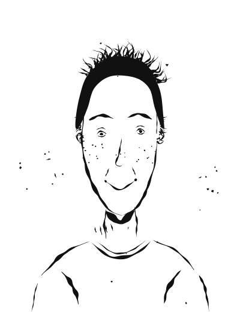

# Katharina "Kat" Müller

Für Dialoge zusätzlich von vorne links ([katharina-mueller-von-links.svg](img/katharina-mueller-von-links.svg)) und von vorne rechts ([katharina-mueller-von-rechts.svg](img/katharina-mueller-von-rechts.svg)).

**Alter:** 29 Jahre (geboren 1997 in Görlitz, Sachsen) · **Position:** Projektmanagerin, BRI Akademie · **Wohnort:** Köln-Ehrenfeld (WG) · **Familienstand:** ledig, in Beziehung mit Lisa (Lehrerin)

**Charakterbogen:** [kat.md](../../Novelle_Zukunft-der-DW/plans/charakterprofile/kat.md)

## Aussehen

Offen, unkompliziert, mit einer wachen und empathischen Ausstrahlung.

## Hintergrund

Aufgewachsen in Görlitz, der Grenzstadt zu Polen, als Tochter einer Krankenschwester und eines Mechanikers, beide aus der ehemaligen DDR. Studium der Internationalen Beziehungen in Dresden, Master in Development Cooperation in Bonn. Seit 2022 Projektmanagerin bei der BRI Akademie mit Fokus auf Osteuropa und Afrika. Lesbisch, seit dem Studium geoutet, in Beziehung mit der Grundschullehrerin Lisa. Spricht Deutsch, Englisch, Polnisch und etwas Russisch.

> "Die BRI Akademie arbeitet nach einem Prinzip: Partnerschaft auf Augenhöhe."

## Charakter

Organisationstalent, empathisch, gute Netzwerkerin mit Gespür für unterschiedliche Kulturen – aber manchmal zu kompromissbereit, mit Angst vor Konfrontation. Ihr Bruder Markus ist seit 2023 AfD-Mitglied; der Kontakt ist abgebrochen.

## Rolle in der Geschichte

Kat baut über ihre Kontakte bei der BRI Akademie die internationalen Hubs des Netzwerks auf – u. a. in Nairobi. Ihre Großeltern erzählten ihr vom Mut in der DDR-Zeit; sie will kein zweites autoritäres System erleben. Die Entscheidung für das Netzwerk zerbricht endgültig den Kontakt zu ihrem Bruder, bringt ihr aber eine neue, selbstgewählte Gemeinschaft.
