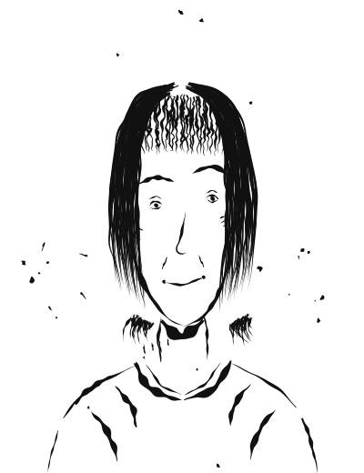

# Lena Kowalski

**Alter:** 33 Jahre (geboren 1993 in Warschau, Polen) · **Position:** Investigative Journalistin, BRI Deutsch · **Wohnort:** Berlin-Kreuzberg · **Familienstand:** ledig

**Charakterbogen:** [lena.md](../../Novelle_Zukunft-der-DW/plans/charakterprofile/lena.md)

## Aussehen

Scharfer Blick, direkte Art.

> "Ich heiße Lena Kowalski. Ich bin investigative Journalistin bei BRI Deutsch. Und ich komme aus Polen."

## Hintergrund

Aufgewachsen in Warschau, Studium des Journalismus dort, Master in investigativem Journalismus an der City University London. Nach Jahren als freie Journalistin und Reporterin bei der *Gazeta Wyborcza* – mit Fokus auf Rechtsextremismus – kam sie 2017 unter der PiS-Regierung nach Deutschland. Seit 2021 investigative Journalistin bei BRI Deutsch. Angespanntes, politisch belastetes Verhältnis zu den Eltern in Warschau. Spricht Polnisch, Deutsch, Englisch und Russisch.

## Charakter

Investigativ brillant, hartnäckig, mutig, gut vernetzt – aber Workaholic, zynisch, mit Schwierigkeiten in Beziehungen und einem Hang zu riskantem Vorgehen.

## Rolle in der Geschichte

Lena hat die Erosion der Demokratie in Polen hautnah miterlebt und will nicht tatenlos zusehen, wie sich das in Deutschland wiederholt. Als Journalistin soll sie eigentlich berichten, nicht handeln – doch die Grenze zwischen Beobachten und Handeln verschwimmt, bis sie selbst zur Zielscheibe der AfD wird. Am Ende wird sie zum öffentlichen Gesicht der Whistleblower: ihre journalistische Karriere endet, ihre Rolle als Aktivistin beginnt.
