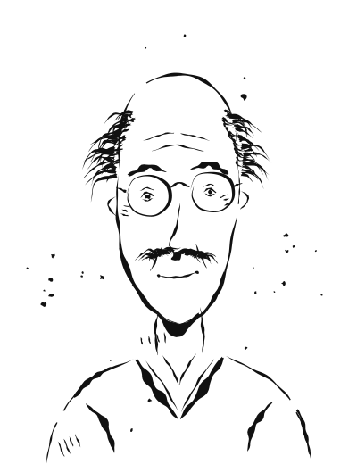

# Prof. Dr. Michael Weber

Für Dialoge zusätzlich von vorne links ([michael-weber-von-links.svg](img/michael-weber-von-links.svg)) und von vorne rechts ([michael-weber-von-rechts.svg](img/michael-weber-von-rechts.svg)).

**Alter:** 58 Jahre (geboren 1968 in Köln) · **Position:** Leiter Research & Cooperations, Bundesrundfunk International (BRI) · **Wohnort:** Bad Godesberg, Bonn · **Familienstand:** verheiratet mit Claudia (56), zwei erwachsene Kinder

**Charakterbogen:** [michael.md](../../Novelle_Zukunft-der-DW/plans/charakterprofile/michael.md)

## Aussehen

Trägt Brille, grauen Mantel im Winter, wache und sorgenvolle Augen. Ein Gesicht, das nachdenkt, bevor es spricht.

> "Michael nahm seine Brille ab und rieb sich die Augen."
> "Michael Weber stand im Türrahmen, Schnee auf seinem grauen Mantel."

## Hintergrund

Studium der Journalistik und Philosophie in München, Promotion und Habilitation in Medienethik. Nach Jahren als Auslandskorrespondent für die ARD (Moskau, Nairobi) seit 2010 beim BRI. Publizierte u. a. *"Whistleblower und Medienethik"* (2015) und *"Pressefreiheit in autoritären Systemen"* (2020). Verheiratet mit Claudia, einer pensionierten Lehrerin, die an Brustkrebs erkrankt ist – sieben Jahre vor der Rente, deren Pension die Behandlung sichert.

## Charakter

Intellektuell brillant, ethisch reflektiert, eine Mentorenfigur – aber zögerlich bei praktischen Entscheidungen, manchmal zu theoretisch, gequält von der Angst um Claudias Gesundheit und seine Pension.

## Rolle in der Geschichte

Der "Ethiker" der Gruppe – hat sein ganzes Leben über Medienethik geschrieben und muss nun seine eigenen Theorien in der Praxis bestehen. Sarahs Gewissen und Mentor. Seine Entscheidung, sich der Verschwörung anzuschließen, kostet ihn womöglich seine Pension, sichert ihm aber sein Vermächtnis: "Aber ich tue es mit offenen Augen."
