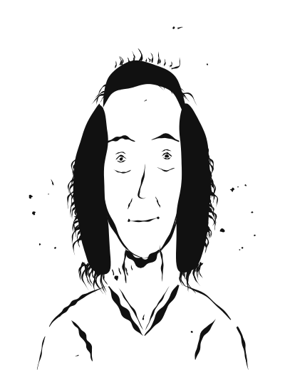

# Dr. Sarah Hoffmann

Für Dialoge zusätzlich von vorne links ([sarah-hoffmann-von-links.svg](img/sarah-hoffmann-von-links.svg)) und von vorne rechts ([sarah-hoffmann-von-rechts.svg](img/sarah-hoffmann-von-rechts.svg)).

**Alter:** 42 Jahre (geboren 1984) · **Position:** Leiterin Corporate Strategy, Bundesrundfunk International (BRI) · **Wohnort:** Bonn-Südstadt · **Familienstand:** geschieden, keine Kinder

**Charakterbogen:** [sarah.md](../../Novelle_Zukunft-der-DW/plans/charakterprofile/sarah.md)

## Aussehen

Eine Frau Anfang vierzig – erschöpft von den Nächten am Bildschirm, aber mit einem Blick, der nicht aufgibt.

## Hintergrund

Studium der Journalistik und Politikwissenschaft in Hamburg, Promotion über öffentlich-rechtliche Medien in Krisenzeiten. Seit 2022 Leiterin Corporate Strategy beim BRI – nach Stationen als Volontärin bei der *tagesschau*, freie Journalistin und Redakteurin. Geschieden von Markus (Architekt), bewusst kinderlos, läuft Marathon zum Ausgleich.

## Charakter

Strategisch, visionär, durchsetzungsstark, mutig – aber Workaholic, mit Angst vor Versagen und einem Hang, zu viel Verantwortung allein zu tragen. Ihr Mentor Michael Weber hat sie geprägt.

## Rolle in der Geschichte

Sarah ist die Initiatorin des geheimen Netzwerk-Projekts: Als der Voice-of-America-Kollaps zeigt, wie schnell ein öffentlich-rechtliches Medienhaus zerschlagen werden kann, entwirft sie den Plan für ein föderiertes, zensurresistentes Sendenetzwerk – und wird damit zur Anführerin einer konspirativen Operation, die sie ihre Karriere kosten, aber zur Symbolfigur für die Fortführung der Mission machen wird.

**Dingsymbol:** der Sendemast-Schlüsselanhänger ihres Doktorvaters Professor Hartwig – Symbol für die alte wie die neue Medienära, das sie am Ende an Tom Schneider weitergibt.
