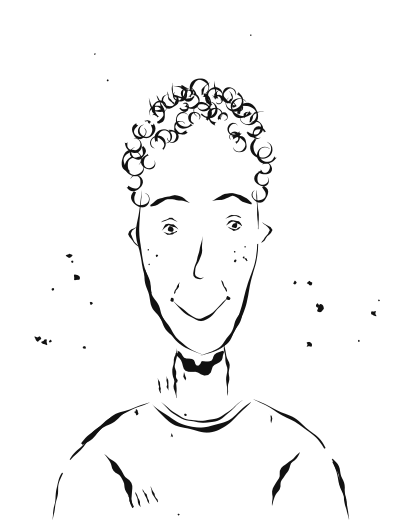

# Tom Schneider

Für Dialoge zusätzlich von vorne links ([tom-schneider-von-links.svg](img/tom-schneider-von-links.svg)) und von vorne rechts ([tom-schneider-von-rechts.svg](img/tom-schneider-von-rechts.svg)).

**Alter:** 26 Jahre (geboren 2000 in München) · **Position:** Junior Developer, BRI Innovation Lab (Werkstudent) · **Wohnort:** Bonn-Nordstadt (WG) · **Familienstand:** ledig

**Charakterbogen:** [tom.md](../../Novelle_Zukunft-der-DW/plans/charakterprofile/tom.md)

## Aussehen

Jung, energiegeladen, zerzaustes Haar nach durchgearbeiteten Nächten.

> "Er war allein im Innovation Lab des BRI, kurz vor Mitternacht. Vor ihm auf dem Bildschirm: Fünf Terminal-Fenster. Fünf SSH-Verbindungen. Fünf Hubs."

## Hintergrund

Aufgewachsen in München als Sohn eines Ingenieurs und einer Lehrerin, Abitur 2018, seither Informatikstudium in Bonn (aktuell Master). Seit 2022 Werkstudent im BRI Innovation Lab, aktiv im Chaos Computer Club und in der Open-Source-Community, spielt Schlagzeug in einer Band. Politisch links, aber nicht dogmatisch.

## Charakter

Technisch versiert, idealistisch, energisch, lernbereit und loyal – aber manchmal naiv, unterschätzt Konsequenzen und ist zu selbstsicher. Macht unter Druck Fehler, die andere gefährden.

## Rolle in der Geschichte

Tom liefert gemeinsam mit Jamal Al-Rashid den technischen Durchbruch für das föderierte Sendenetzwerk und bringt über eine Kontaktperson mit CCC- und Tor-Project-Aufklebern wichtiges Fachwissen zu Verschlüsselung und Zensurumgehung ein. Für ihn ist die Entscheidung zunächst die einfachste – er hat am wenigsten zu verlieren. Doch er muss lernen, dass Idealismus nicht mit Naivität verwechselt werden darf. Am Ende reift er zum verantwortungsvollen Aktivisten und erhält von Sarah den Sendemast-Schlüsselanhänger – als Zeichen, dass die Fackel weitergereicht wird.
