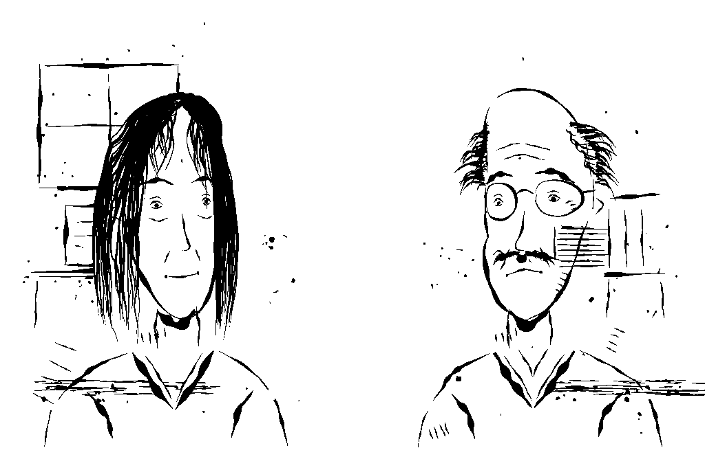

[[spielen]]
= Das Spiel spielen

== Öffnen

Zwei Wege, "Das Netzwerk" zu starten:

* Decker öffnen, dann über *Datei → Öffnen* die Datei
  `game/build/netzwerk.deck` auswählen.
* Oder `game/build/netzwerk.html` direkt in einem Browser öffnen, ganz ohne
  Decker zu installieren. Praktisch, wenn du das Spiel jemandem zeigen
  willst, der Decker nicht hat.

Steuerung ist ausschließlich die Maus: Text weiterklicken, eine
Antwortmöglichkeit anklicken. Es gibt keine Tastenkürzel, die du lernen
müsstest.

[NOTE]
====
Sobald das Spiel in Decker offen ist, achte darauf, dass das Werkzeug
*Interact* ausgewählt ist (oben in der Werkzeugleiste, oder Taste `F1`).
Nur dann reagiert das Deck auf Klicks statt auf Bearbeitungswerkzeuge.
====

== Die Titelkarte

Auf der Titelkarte stehen vier Knöpfe:

[cols="1,3"]
|===
|Knopf |Wirkung

|*Neu beginnen*
|Startet die Geschichte von vorn, ab der ersten Passage der Szenendatei.
Ein vorhandener Spielstand wird dabei überschrieben.

|*Weiterspielen*
|Erscheint nur, wenn es einen unfertigen Spielstand gibt (siehe unten), und
setzt die Geschichte an genau der Stelle fort, an der du zuletzt warst.

|*Kapitel*
|Öffnet den Kapitelindex, siehe unten.

|*Rechtlicher Hinweis*
|Zeigt den vollständigen rechtlichen Hinweis der Novelle, wortgleich aus
`game/data/hinweis.txt`.
|===

Darunter zeigt die Titelkarte deinen Fortschritt: "Noch nicht begonnen.",
"Zuletzt: <Kapiteltitel>." oder "Durchgespielt.", je nachdem, was der
gespeicherte Spielstand hergibt.

== Der Kapitelindex

Der Kapitelindex listet jeden Kapitelanfang mit seinem Titel. Bereits
gespielte Kapitel (und immer das erste) sind anklickbar und springen direkt
dorthin; noch nicht erreichte stehen mit dem Zusatz "(noch nicht gespielt)"
da und lassen sich nicht anklicken. Das ist keine separate Tabelle, die
Liste entsteht aus den Metadaten der Szenendatei selbst, siehe
<<das-datenformat>>.

Ein Sprung aus dem Index setzt die Geschichte an diesem Kapitelanfang fort,
mit denselben Variablen, die du bis dahin gesammelt hast. Es ist ein Sprung
innerhalb derselben Geschichte, kein neuer Anfang.

== Der Menü-Knopf

Auf jeder Karte außer der Titelkarte selbst sitzt oben rechts ein Knopf
*Menü*. Ein Klick darauf sichert deinen aktuellen Stand und bringt dich
zurück zur Titelkarte.

[NOTE]
====
Technisch ist das ein Sonderfall: während eine Textbox oder eine Auswahl
auf dem Bildschirm steht, blockiert Decker die normale Ereigniszustellung,
ein gewöhnlicher Klick-Handler auf dem Menü-Knopf würde also nie ausgelöst.
Die Engine prüft die Zeigerposition deshalb selbst bei jedem
Animationsereignis (`vn_heim_geklickt` in `game/lil/vn.lil`) und bricht die
Erzählschleife sauber zwischen zwei Textboxen ab, siehe
<<software-architektur>>.
====

== Speichern und Weiterspielen

Nach jeder einzelnen Passage schreibt die Engine deinen kompletten
Spielstand (aktuelle Passage, alle Variablen, welche Passagen du schon
gesehen hast) in ein unsichtbares Feld auf der Karte `daten`. Du musst
dafür nichts tun, es passiert automatisch. "Weiterspielen" auf der
Titelkarte erscheint deshalb genau dann, wenn dieser Stand existiert und
die Geschichte noch nicht zu Ende gespielt wurde.

[IMPORTANT]
====
Wie beim zugehörigen Tilemap-Spiel "Das Netzwerk" (zelda-network) gilt: die
interaktive Decker-App darf aus Sicherheitsgründen keine Dateien selbst von
der Festplatte nachladen. Nach jedem Neubau des Decks (siehe
<<einrichtung>>) musst du `netzwerk.deck` deshalb in Decker neu öffnen,
damit deine Änderungen ankommen. Der gespeicherte Spielstand steckt *im*
Deck selbst, ein frisch gebautes Deck hat also wieder einen leeren Stand.
====

== Wie Entscheidungen wirken

An den meisten Entscheidungspunkten stehen zwei bis drei
Antwortmöglichkeiten. Über den Antwortknöpfen steht eine Frage, entweder
die Standardfrage "Was tust du?" oder eine eigene, die in der Szenendatei
mit einem `?` eingeleitet wird.

Die meisten dieser Entscheidungen ("Haltungswahlen") führen nach ein bis
zwei Passagen wieder in denselben Handlungsstrang zurück, verändern dabei
aber eine der drei Haltungsvariablen (`entschlossenheit`, `vorsicht`,
`zusammenhalt`). Diese Variablen färben späteren Text (siehe die
`{if ... else ... end}`-Stellen in der Szenendatei) und am Ende den
Epilog, ändern aber nicht, *welche* Ereignisse stattfinden: die Novelle
bleibt in ihrem Verlauf kanonisch. Die einzige echte Verzweigung der
gesamten Geschichte liegt in Kapitel 15, der Abstimmung. Mehr dazu, mit
allen Variablen im Detail, in <<handlung>>.
