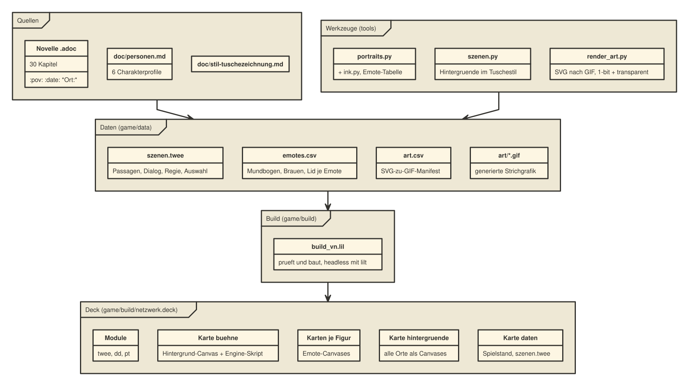
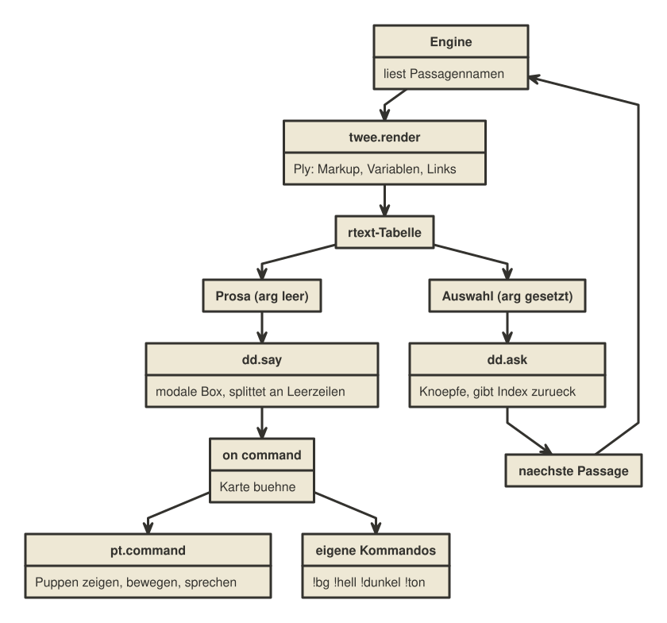
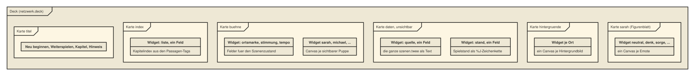

[[software-architektur]]
= Software-Architektur

Dieses Kapitel ist das technische Kernkapitel des Handbuchs. Es erklärt,
wie aus drei fertigen, nicht füreinander gebauten Decker-Modulen und einer
einzigen Textdatei eine spielbare Erzählung wird. Wenn du nur Text ändern
oder Szenen ergänzen willst, brauchst du dieses Kapitel nicht unbedingt,
siehe <<bearbeiten>>. Wenn du an der Engine selbst etwas ändern willst,
ist es Pflichtlektüre.

== Drei Module, eine Erzählmaschine

Die drei Decker-Module decken je eine Schicht ab:

[cols="1,1,3"]
|===
|Modul |Schicht |Liefert

|`twee` / Ply
|Struktur
|Passagen, Links, Variablen, eingebettete Lil-Fragmente

|`dd` (Dialogizer)
|Präsentation
|modale Dialogbox, Klick-durch, Auswahlknöpfe, Textanimation

|`pt` (Puppeteer)
|Darstellung
|Figuren auf der Bühne, Emotes, Blinzeln, Sprechanimation, Bewegung
|===

Keines dieser Module wurde entworfen, um mit den anderen beiden
zusammenzuarbeiten. Dass sie trotzdem genau ineinanderpassen, wurde vor
dem eigentlichen Bau **headless mit `lilt` geprüft**, bevor überhaupt eine
Zeile Engine-Code entstand (`plans/graphic-novel-plan.md`, Abschnitt 2).
Zwei Befunde daraus tragen die ganze Architektur:

* `twee.render[]` liefert eine Tabelle mit den Spalten `text`, `font`,
  `arg` und `pat`. Zeilen mit leerem `arg` sind Prosa, Zeilen mit gefülltem
  `arg` sind Auswahlmöglichkeiten mit `arg` als Sprungziel. Mehr dazu
  unten.
* Eine Regieanweisung wie `!show sarah sorge centerleft` ist für Ply
  gewöhnlicher Fließtext und landet unverändert in der Prosa. Dialogizer
  erkennt jede Zeile in Rich Text, die mit `!` beginnt, als Kommando und
  schickt sie als `command`-Ereignis an die aktuelle Karte. Regie ist damit
  reiner Text in der twee-Datei, kein Sonderfall im Code.

`build_vn.lil` baut das Deck deshalb aus drei fertigen Modul-Decks
zusammen, ganz ohne die Module selbst anzufassen:

[source,lil]
----
nd:newdeck[]
nd.add[tweedeck.modules.twee]
nd.add[read["" fuse (DECKS,"dialog.deck")].modules.dd]
nd.add[read["" fuse (DECKS,"puppeteer.deck")].modules.pt]
----

== Die Engine als Deck-Skript

Der eigentliche Klebstoff zwischen den drei Modulen ist `game/lil/vn.lil`,
gut 650 Zeilen Lil. `build_vn.lil` setzt diese Datei als Skript des
gesamten Decks ein:

[source,lil]
----
nd.script:read["game/lil/vn.lil"]
----

Decker verkettet Deck-, Karten- und Widget-Skripte: jede Karte und jeder
Knopf im fertigen Deck sieht deshalb alle Funktionen, die in `vn.lil`
definiert sind (`vn_spiele`, `vn_kommando`, `vn_sprecher`, und so weiter).
Ein Klick auf "Neu beginnen" auf der Titelkarte ruft am Ende nur
`vn_start[1]` auf.

== Warum die ganze Geschichte in einer blockierenden Schleife läuft

Das ist die zentrale Entwurfsentscheidung der Engine: es gibt **eine
einzige Funktion**, `vn_spiele`, die die komplette Erzählung von der
Startpassage bis zum Ende (oder bis zum Abbruch über den Menü-Knopf)
durchläuft, in einer `while`-Schleife. Möglich ist das, weil `dd.say[]`
und `dd.ask[]` **synchron** sind: sie kehren erst zurück, wenn die
spielende Person geklickt hat. Ein kompletter Spieldurchlauf passt damit
in einen einzigen Skriptaufruf.

Während `dd.say[]` oder `dd.ask[]` intern warten, schickt Decker trotzdem
weiterhin `animate`-Ereignisse an die aktuelle Karte, sodass Puppen weiter
blinzeln und Regieanweisungen greifen, ohne dass die Hauptschleife dafür
etwas Besonderes tun muss:

[source,lil]
----
on animate do
  pt.animate[deck]
  if deck.card~buehne
    if vn_heim_geklickt[] buehne.widgets.abbruch.text:"1" end
  end
end
----

Genau dieser Nebeneffekt macht auch den Menü-Knopf möglich: solange die
Hauptschleife läuft, blockiert Decker die normale Klick-Zustellung, aber
`animate` kommt weiter durch. `vn_heim_geklickt` liest deshalb Zeigerposition
und Klickstatus direkt aus `pointer.pos` und `pointer.down` und setzt nur
einen Merker (`buehne.widgets.abbruch`), den die Hauptschleife zwischen
zwei Textboxen prüft und dann sauber abbricht.

== Von einer Ply-Passage zu Prosa und Auswahl

Der Kern der Hauptschleife rendert eine Passage und trennt das Ergebnis in
zwei Teile:

[source,lil]
----
r:twee.render[story s.passage s.vars]
s.vars:r.vars
zeilen:r.value
# ACHTUNG: "where 0<count arg" waere ein stiller No-Op-Filter, weil count
# die ganze Spalte aggregiert statt zeilenweise zu zaehlen. Richtig ist
# die zeilenweise Form "where !arg=\"\"".
prosa:select where arg="" from zeilen
wahl:select where !arg="" from zeilen
----

`twee.render[]` liefert für eine Passage mit Text und zwei Links eine
Tabelle mit den Spalten `text`, `font`, `arg` und `pat`. Zeilen, deren
`arg`-Spalte leer ist, sind normaler Fließtext oder Regie und gehen an
`dd.say[]` bzw. an die eigene Kommandoerkennung. Zeilen mit gefülltem `arg`
sind Ply-Links: `text` ist die Beschriftung des Knopfes, `arg` ist der
Name der Zielpassage.

[IMPORTANT]
====
Der naheliegende Ausdruck `where 0<count arg` sieht nach derselben
Bedingung aus, filtert in Lils Query-Syntax aber überhaupt nicht: `count`
aggregiert dort die ganze Spalte zu einer einzigen Zahl statt zeilenweise
zu zählen, die Bedingung ist damit für jede Zeile konstant wahr. In einer
frühen Fassung der Engine führte das zu einer Endlosschleife, weil als
Sprungziel ein leerer Passagenname herauskam. Gefunden hat das der Test,
nicht das Lesen. Die korrekte, zeilenweise Form ist `where !arg=""` (In
`where`-Klauseln gehört ohnehin `=` hin, nicht `~`, siehe
<<lil-fuer-ungeuebte>>).
====

Danach unterscheidet die Schleife drei Fälle, je nachdem wie viele
Auswahlzeilen es gibt:

[source,lil]
----
if 0~count wahl
  laeuft:0
elseif 1~count wahl
  vn_erzaehle[first labels]
  s.passage:first ziele
  vn_speichern[s]
else
  dd.style[vn_stil_frage[]]
  i:dd.ask[frage labels]
  s.passage:ziele[i]
  vn_speichern[s]
end
----

Keine Auswahl heißt: Ende der Erzählung. Genau eine Auswahl ist keine
Entscheidung, sondern eine reine Fortsetzung, und wird als letzte
Textbox gezeigt statt als sinnloser Ein-Knopf-Dialog (deshalb tragen
Fortsetzungslinks in der Szenendatei sprechende Beschriftungen wie
"Es klopft." statt Platzhaltern wie "Weiter."). Erst ab zwei Auswahlzeilen
erscheint die Frage mit echten Knöpfen über `dd.ask[]`.

Wie eine Passage im Detail zu Prosa und Regie wird, inklusive
Sprechererkennung, steht in `vn_prosa`:

[source,lil]
----
on vn_prosa zeilen do
  frage:"Was tust du?"
  segmente:rtext.split["\n\n" zeilen]
  each seg in segmente
    roh:rtext.string[seg]
    t:vn_ohne_rand[roh]
    if vn_abbruch[]
      t:""
    elseif "?"~t[0]
      frage:vn_rest[t "?"]
    elseif "!"~t[0]
      command[t]
    else
      if 0<count t vn_sag[seg roh] end
    end
  end
  frage
end
----

Kommandos werden hier absichtlich selbst erkannt, nicht `dd.say[]`
überlassen: Dialogizer prüft beim Kommando-Erkennen nur das allererste
Zeichen eines Absatzes. Ein Lil-Fragment davor, das nichts ausgibt (etwa
`{vorsicht:vorsicht+1 ""}`), hinterlässt einen Zeilenumbruch, und die
Regieanweisung dahinter wäre dann stillschweigend zu Fließtext geworden.
Deshalb schneidet `vn_ohne_rand` führende Leerräume selbst ab, bevor
geprüft wird.

== Der Spielstand als %J-Zeichenkette

Der komplette Spielstand ist ein einziges Dictionary
(`passage`, `vars`, `gesehen`, `beendet`) und wird nach jeder Passage in
ein unsichtbares Feld auf der Karte `daten` geschrieben:

[source,lil]
----
on vn_speichern s do
  daten.widgets.stand.text:"%J" format s
end

on vn_laden do
  t:daten.widgets.stand.text
  if 0~count t 0 else "%J" parse t end
end
----

`"%J" format` wandelt ein Lil-Dictionary in eine JSON-Zeichenkette,
`"%J" parse` liest sie verlustfrei zurück, auch mit Umlauten im Text. Weil
dieses Feld ein gewöhnliches Widget des Decks ist, überlebt der Spielstand
das Schließen und Wiederöffnen von Decker, obwohl die Erzählschleife selbst
niemals unterbrochen wird, sondern nur zwischen zwei Textboxen sauber
endet.

== Die Karten des Decks

`build_vn.lil` legt folgende Karten an:

[cols="1,3"]
|===
|Karte |Inhalt

|`titel`
|Die Knöpfe "Neu beginnen", "Weiterspielen", "Kapitel", "Rechtlicher
Hinweis" sowie eine Fortschrittsanzeige.

|`index`
|Ein Feld mit dem Kapitelindex, aus den Passagen-Metadaten erzeugt.

|`hinweis`
|Der rechtliche Hinweis der Novelle, wortgleich aus `game/data/hinweis.txt`.

|`buehne`
|Die eigentliche Spielkarte: Ortsmarke, verdeckte Zustandsfelder
(`stimmung`, `tempo`, `erzaehlerpos`, `abbruch`) und, sobald eine Figur
auftritt, ein Canvas-Widget je sichtbarer Puppe, von Puppeteer selbst
angelegt.

|`daten`
|Unsichtbar im Spiel. Enthält die komplette `szenen.twee` als Text
(`quelle`) und den aktuellen Spielstand (`stand`).

|`hintergruende`
|Unsichtbar. Ein Canvas je Ort, aus `game/data/art/hintergruende/*.gif`.

|eine Karte je Figur (`sarah`, `michael`, `jamal`, `kat`, `lena`, `tom`
und ihre `_r`/`_l`-Varianten)
|Puppeteers Figurenblätter: ein Canvas je Emote, siehe <<die-bilder>>.
|===

Hintergründe werden zur Laufzeit nicht als Kartenwechsel behandelt, sondern
als Kopie eines Canvas in das Bühnenbild:

[source,lil]
----
on vn_hintergrund name do
  h:hintergruende.widgets[name]
  if h
    buehne.image:h.copy[]
  else
    buehne.image.clear[]
  end
end
----

Das vermeidet jedes Nachladen von der Platte, was die interaktive
Decker-App aus Sicherheitsgründen ohnehin nicht dürfte.
