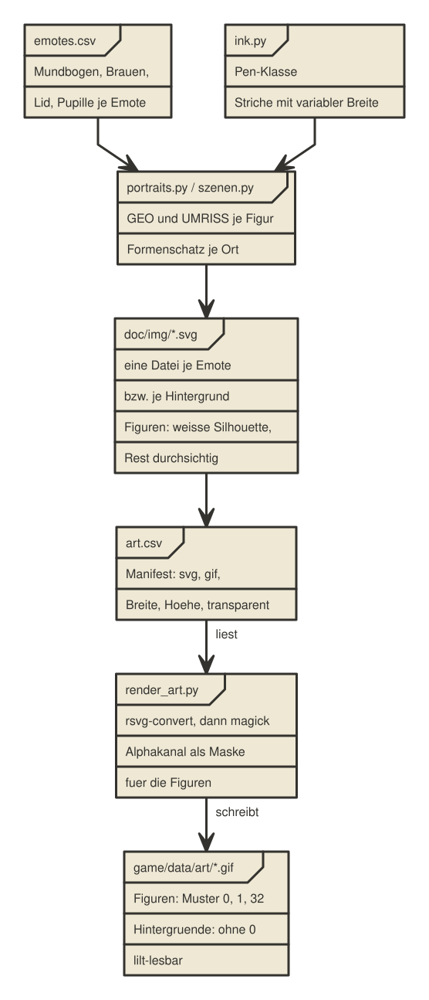
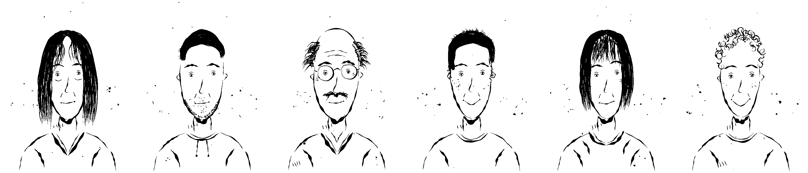
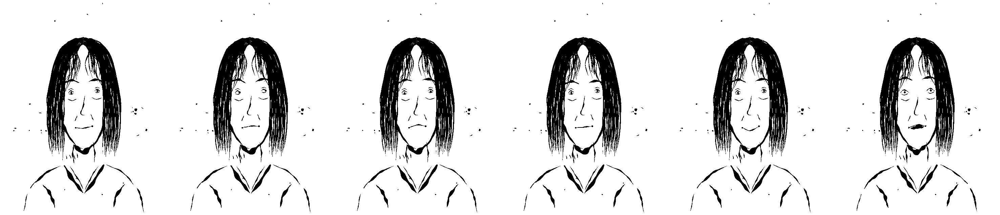
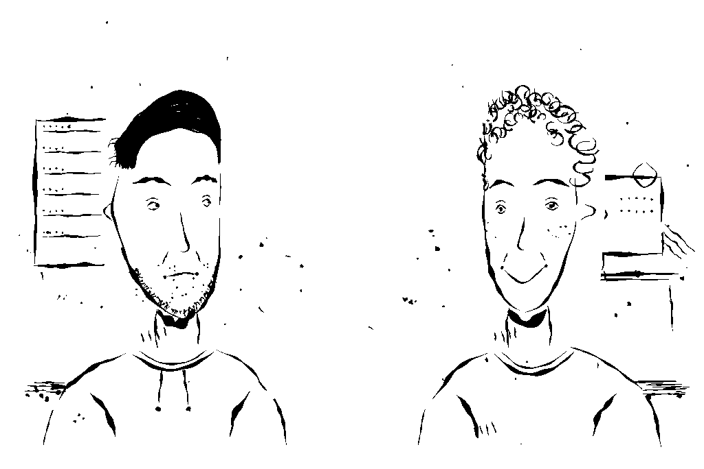
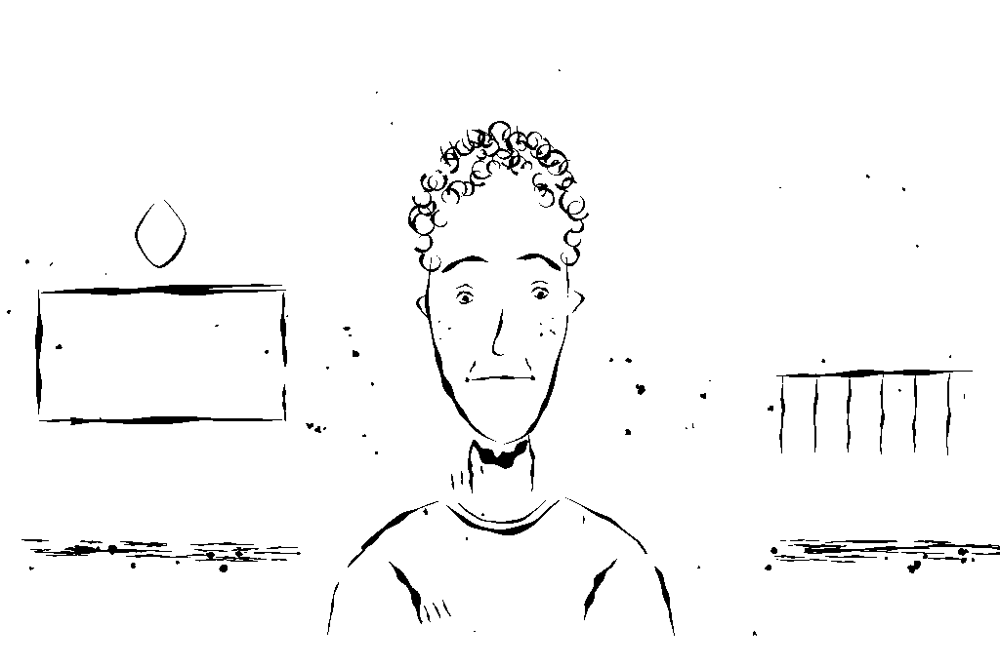
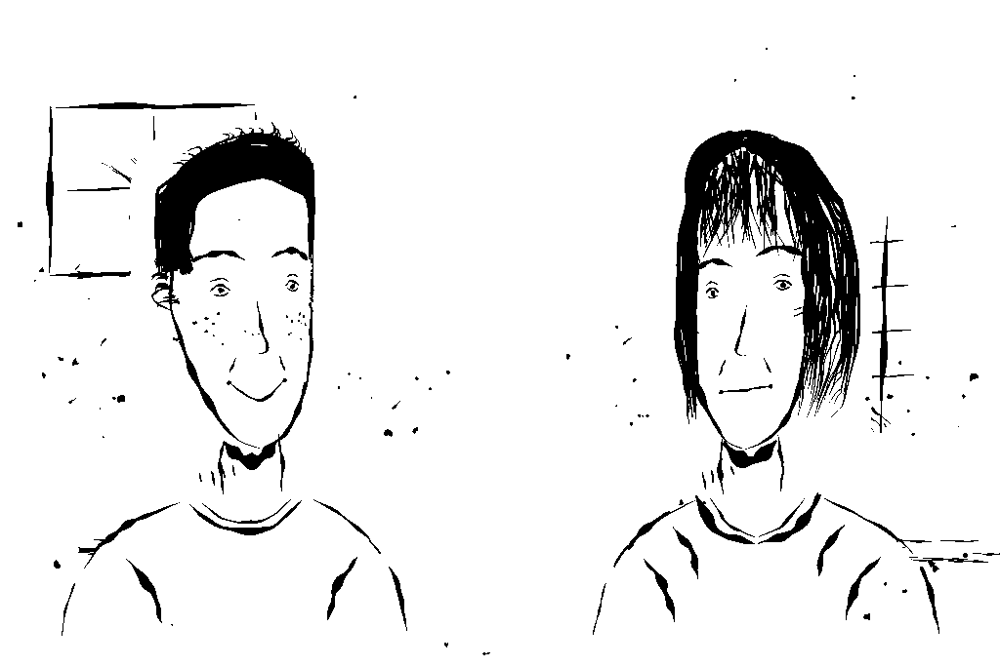

[[die-bilder]]
= Die Bilder

Jede Zeichnung im Spiel ist generiert, keine ist von Hand in einem
Zeichenprogramm entstanden. Das gilt für die sechs Figuren genauso wie für
die 18 Hintergründe. Vorlage ist der Tuschezeichnungsstil der
Urmel-Bücher (Erich Hölle), verbindlich beschrieben in
`doc/stil-tuschezeichnung.md`. Dieses Kapitel erklärt, wie aus Python-Code
Tuschezeichnungen werden, und wie die daraus entstehenden SVGs zu den
1-Bit-GIFs werden, die `lilt` tatsächlich lesen kann.

== `ink.py`: der Strichgenerator

Das zentrale Stilmerkmal ist die **variable Strichbreite**: ein echter
Federstrich setzt haarfein an, schwillt an, wo Druck auf der Feder liegt,
und läuft spitz aus. Ein SVG-`stroke` mit fester `stroke-width` kann das
grundsätzlich nicht, deshalb zeichnet `tools/ink.py` jeden Strich als
**gefüllten Umriss** entlang einer Mittellinie mit einem Breitenprofil:

[source,python]
----
def _profile(t, w):
    """Breite an Position t. w = (Anfang, Mitte, Ende).

    Lagrange durch (0,w0), (0.5,w1), (1,w2): die Mittenbreite wird
    tatsaechlich erreicht -- bei quadratischer Mischung waere sie nur halb
    so gross wie angegeben."""
    w0, w1, w2 = w
    return (w0 * 2 * (t - 0.5) * (t - 1)
            - w1 * 4 * t * (t - 1)
            + w2 * 2 * t * (t - 0.5))
----

`Pen.stroke()` nimmt eine Liste von Stützpunkten, glättet sie mit einem
Catmull-Rom-Spline (`catmull()`), tastet sie in gleichmäßigen Abständen ab
(`resample()`, wichtig, damit das Breitenprofil sauber sitzt) und legt
zusätzlich ein niederfrequentes Zittern quer zur Laufrichtung darüber
(`wobble()`) -- "die Hand ist keine CNC-Fräse", wie der Kommentar im Code
sagt. `outline()` baut daraus den geschlossenen Pfad mit runden
Endkappen. Auf dieser Basis bietet `Pen` eine kleine Zeichen-API:

[cols="1,3"]
|===
|Methode |Wofür

|`stroke()`
|ein einzelner Federstrich, optional mit `cuts` für abgesetzte, offene
Konturen

|`blob()` / `dot()`
|unregelmäßiger Tuscheklecks bzw. Punkt

|`patch()`
|geschlossene Tuschefläche mit unruhigem Rand, für Haarmassen

|`strands()`
|eine Haarpartie als Bündel einzelner Strähnen zwischen zwei Leitkurven,
die an beiden Enden ausfranst statt als geschlossene Kappe zu stehen

|`curls()`
|Lockenkopf aus offenen Spiralzügen

|`hairs()`
|Bündel auslaufender Striche, dick am Ansatz, spitz am Ende

|`spatter()`
|Tuschespritzer rund um die Figur, mit eigenem Zufallsstrom (siehe unten)

|`hatch()`
|lockere, leicht divergierende Schraffur
|===

Auch die Kopfdrehung für die drei Blickrichtungen steckt in `ink.py`,
als Zylinderprojektion um die Hochachse (`Pen.set_turn`): Punkte auf der
Kopfrundung wandern über die Silhouette hinweg, während deren Rand fast
stehen bleibt, genau wie bei einem wirklich gedrehten Kopf. `!flip` wird
dafür bewusst **nicht** benutzt, eine gespiegelte Tuschezeichnung sähe
falsch aus (der Nasenhaken zeigt dann in die falsche Richtung).

[TIP]
====
`spatter()` bekommt einen eigenen Zufallsstrom (`rng_seed`), unabhängig
vom Rest der Zeichnung. Ohne diese Trennung würden die Tuschespritzer
davon abhängen, wie viel Zufall das Gesicht davor schon verbraucht hat,
und beim Umschalten zwischen Emotes sichtbar wackeln, obwohl sie auf dem
Papier liegen und sich eigentlich nicht bewegen dürften.
====

== `portraits.py`: Gesichtsgeometrie je Figur, Emotes als Tabelle

`tools/portraits.py` zeichnet die sechs Figuren. Haare, Kleidung,
Silhouette und Tuschespritzer sind figurenspezifischer Code (die
Funktionen `sarah()`, `michael()`, `jamal()`, `kat()`, `lena()`, `tom()`).
Augen, Brauen, Nase und Mund dagegen sind **Daten**: jede Figur deklariert
ihre Gesichtsgeometrie als Dictionary in `GEO`, zum Beispiel Sarah:

[source,python]
----
"sarah": {
    "auge_l": dict(x=170, y=224, r=7.6, tilt=0.8),
    "auge_r": dict(x=234, y=220, r=7.2, tilt=-0.4),
    "braue_l": dict(pts=[(150, 200), (172, 193), (190, 199)],
                     w=(1.5, 4.6, 0), amp=0.6, aussen_erst=True),
    "braue_r": dict(pts=[(212, 197), (232, 191), (252, 199)],
                     w=(0, 4.8, 1.5), amp=0.6, aussen_erst=False),
    "nase": dict(x=202, y0=230, y1=274, w=8),
    "mund": dict(x0=181, y0=310, x1=222, y1=306, bow=3),
},
----

Wie ein **Emote** diese Geometrie verändert (Mundbogen, Brauenneigung,
Lidstellung, Pupillenversatz, Mundöffnung, Augengröße), steht als Tabelle
in `game/data/emotes.csv`, nicht im Python-Code:

[source]
----
emote,bow,braue_innen,braue_aussen,lid,pupille_x,pupille_y,mund_offen,augen_gross,bogen_daempfung
neutral,3,0,0,1,0,0,0,1.0,1.0
denk,-2,1,-4,1,4,-1,0,1.0,0.6
sorge,-5,-4,2,1,0,1,0,1.0,0.2
ent,0.5,3,3,1,0,0,0,1.0,0.15
freude,9,-1,-2,1,0,0,0,1.0,0.6
schock,-1,-6,-6,0,0,-1,1,1.45,0.3
----

`braue()` verschiebt das innere und das äußere Ende eines Brauenstrichs
gemäß `braue_innen`/`braue_aussen`, die Punkte dazwischen linear
interpoliert. `mundzug()` baut den Mund aus den Eckpunkten der Figur und
einem Bogen, der aus figureneigener Grundkrümmung und Emote-Abweichung
gemeinsam entsteht:

[source,python]
----
def wirksamer_bogen(spec, row):
    """Mundbogen aus figureneigener Grundkruemmung und Emote-Abweichung.

    Ohne die Grundkruemmung waeren alle sechs Figuren im neutralen Ausdruck
    gleich, und Kat, Lena und Tom haetten ihren Gesichtsausdruck verloren.
    Wie stark sie in ein Emote hineinwirkt, steht als "bogen_daempfung" in
    der Emote-Tabelle: ausdrucksstarke Emotes wie "ent" verdraengen sie fast
    ganz (sonst grinst Tom auch entschlossen noch), weiche wie "freude"
    behalten sie."""
    neutral_bow = EMOTES["neutral"]["bow"]
    basis = spec.get("bow", neutral_bow)
    if row.get("emote") == "neutral":
        return basis
    return row["bow"] + row["bogen_daempfung"] * (basis - neutral_bow)
----

Diese eine Funktion löst ein Problem, das erst im Bildvergleich auffiel:
eine gemeinsame Emote-Tabelle für alle sechs Figuren hätte Kats warmes
Lächeln (Grundbogen 15) und Toms Dauergrinsen (21) verschwinden lassen,
weil `neutral` für alle denselben Wert setzt. Die Dämpfung sorgt dafür,
dass Tom auch besorgt noch etwas freundlicher wirkt als Lena, ohne dass
`sorge` bei ihm zum Lächeln wird.

== Drei Blickrichtungen, Blinzel- und Sprechbilder

Jede Figur liegt in drei Ansichten vor: frontal, `_r` (Kopfdrehung +0.30,
Gesicht nach rechts, die Puppe steht also links auf der Bühne) und `_l`
(Drehung -0.30, steht rechts). Sprechen zwei Figuren miteinander, wenden
sie sich dadurch einander zu. Technisch sind das drei eigenständige Puppen
mit eigenen Zeichnungen, weil Puppeteer eine Puppe über den Namen ihrer
Karte anspricht; in der Szenendatei steht trotzdem immer nur der schlichte
Name, die Engine wählt die passende Variante zur Laufzeit aus der
Bühnenposition, siehe <<software-architektur>>.

Pro Figur und Blickrichtung entstehen 14 Canvases:

* sechs Basis-Emotes (`neutral`, `denk`, `sorge`, `ent`, `freude`,
  `schock`)
* dieselben sechs mit offenem Mund (`<emote>_open`), für die
  Sprechanimation
* zwei Blinzelbilder (`neutral_blink`, `ent_blink`) für die beiden
  Emotes, in denen Figuren laut Plan am längsten stehen

`_blink` ist dabei keine eigene Tabellenzeile in `emotes.csv`, sondern ein
Schalter in der Zeichenfunktion selbst: das Auge wird durch einen
einzelnen geschlossenen Bogen statt Mandel plus Pupille ersetzt. `_open`
ist einfach die Emote-Zeile mit `mund_offen=1`. Macht man die Rechnung
über alle sechs Figuren und drei Blickrichtungen, kommt man auf
6 Figuren mal 14 Bilder mal 3 Richtungen, also 252 Einzelzeichnungen,
generiert in wenigen Sekunden.

== Hintergründe: `szenen.py`

18 Hintergründe decken alle 30 Kapitel ab. `tools/szenen.py` baut sie aus
demselben `ink.Pen` wie die Portraits, aber mit einem eigenen
**Formenschatz**, abgeleitet aus den Urmel-Vorlagen: Kasten, Tisch, Stuhl,
Fenster, Regal, Serverschrank, Apparat, Kolben, Pflanze, Papierstapel,
Mikrofon, Sofa. Drei Grundregeln aus den Vorlagen bestimmen jede Szene:

. Es gibt keinen Horizont und keine Wände. Die Gegenstände stehen auf
  weißem Papier.
. Der Boden ist nur angedeutet: lockere waagerechte Schraffur, ein paar
  Steinchen, Tuschespritzer, dazu ein schwerer Zug, der die Linie trägt.
  Nie eine gefüllte Fläche.
. Geräte und Möbel sind offene, leicht schiefe Umrisse mit wenigen
  Details: Knöpfe als Kreise, Nieten und Tasten als Punktreihen,
  Holzlatten als drei parallele Striche.

Ein Kasten zum Beispiel:

[source,python]
----
def kasten(p, x, y, b, h, w=FEIN, offen=True):
    """Leicht schiefer Kasten.

    Nur eine Kante bricht auf, und die Linien schiessen ueber die Ecken
    hinaus. Braechen alle vier Kanten symmetrisch in der Mitte, entstuenden
    vier Eckwinkel statt einer Form."""
----

**Warum die Bildmitte frei bleibt:** dort stehen im Spiel die Figuren, und
was hinter ihnen liegt, sieht man ohnehin nicht. Ein Gegenstand in der Mitte
wäre also Arbeit, die niemand zu Gesicht bekommt, und bei einer einzelnen
Figur auf `center` säße er genau hinter ihrem Kopf. Deshalb stehen die
Gegenstände in `szenen.py` konsequent am linken und rechten Rand
(`LINKS, RECHTS = 150, 874` bei 1024 Pixel Breite), und die Mitte bleibt
Papier. Das ist keine Notlösung, sondern genau der Aufbau der
Urmel-Vorlagen selbst: dort stehen die Dinge neben der Figur, nicht hinter
ihr.

Zwei Fallen, die beim Zeichnen der Formen immer wieder auftauchen:

* Bricht ein Kasten an allen vier Kanten symmetrisch in der Mitte auf,
  entstehen vier Eckwinkel statt einer Form. Nur eine Kante darf brechen,
  und die Linien müssen über die Ecken hinausschießen.
* Waagerechte Striche übereinander sind kein Papierstapel, sondern
  Schraffur. Erst die seitlichen Kanten und ein schwerer Zug oben machen
  daraus einen Stapel. Dasselbe gilt für Schatten: wenige kurze Striche
  dicht unter dem Gegenstand, nie ein Block daneben.

== Von SVG zu GIF: `render_art.py` und die Silhouetten-Kette

`lilt` (und damit Decker) liest keine `.svg`- oder `.png`-Dateien, nur
`.gif`. `tools/render_art.py` liest dafür `game/data/art.csv`, ein
Manifest mit den Spalten `svg`, `gif`, `breite`, `hoehe`, `transparent`,
und führt für jede Zeile dieselbe zweistufige Kette aus: zuerst
`rsvg-convert`, dann `magick`.

[source,python]
----
lauf = subprocess.run(
    ["rsvg-convert", "-w", breite, "-h", hoehe, svg_pfad, "-o", png_pfad],
    capture_output=True, text=True,
)
...
lauf = subprocess.run(
    ["magick", png_pfad, "-background", "white", "-alpha", "remove",
     "-alpha", "off", "-threshold", "60%", sw_pfad],
    capture_output=True, text=True,
)
----

[IMPORTANT]
====
Die Reihenfolge ist entscheidend: erst weiß unterlegen und schwellwerten,
dann erst weiß transparent schalten. Der naheliegende direkte Weg über
`-background none` erzeugt Anti-Aliasing-Farben an den Kanten (Decker
zeigt sie als eigene Muster, zum Beispiel 32, 44, 45, 46) und macht dabei
ausgerechnet Schwarz mit transparent -- also das Gegenteil dessen, was man
will. Das Ergebnis der richtigen Reihenfolge sind exakt zwei Muster:
Muster 0 (transparent) und Muster 1 (schwarze Tusche).
====

Für Hintergründe (`transparent=0` im Manifest) ist damit schon Schluss,
das Bild bleibt einfach deckend schwarz-weiß. Für Figuren
(`transparent=1`) kommt ein Schritt dazu, und der beginnt schon in der
Zeichnung.

=== Warum die Figur weißes Papier braucht

In den Urmel-Vorlagen ist eine Figur weißes Papier mit Tusche darauf. Sie
verdeckt, was hinter ihr liegt, genau wie ein Gegenstand im Vordergrund.
Eine Zeichnung, die nur aus Tuschestrichen bestünde, könnte das nicht: der
Hintergrund läge dann im Gesicht, das Fensterkreuz im Auge, die
Bodenschraffur quer über dem Mund. Die Figur braucht also ihre eigene weiße
Fläche.

Hergestellt wird das nicht durch Bildbearbeitung, sondern beim Zeichnen:
`umriss()` in `tools/portraits.py` legt vor allem anderen eine geschlossene
Fläche über Haar, Kopf, Hals und Schultern.

[source,python]
----
def umriss(p, kurz):
    """Weisse Silhouette der Figur, vor der Tusche gezeichnet."""
    u = UMRISS[kurz]
    cx = 200
    pts = [(cx - u["hw_seite"], u["seite"])]
    pts += [(cx - u["hw_oben"], u["oben"] + 26), (cx, u["oben"]),
            (cx + u["hw_oben"], u["oben"] + 26)]
    pts += [(cx + u["hw_seite"], u["seite"]),
            (cx + u["hw_haar"], u["haar_y"])]
    pts += SCHULTER_R
    pts += [(400, 524), (400, 528), (0, 528), (0, 524)]
    pts += list(reversed(SCHULTER_L))
    pts += [(cx - u["hw_haar"], u["haar_y"])]
    p.flaeche(pts, wob=1.6)
----

Je Figur sind das sechs Zahlen in `UMRISS`: der Scheitelpunkt, die halbe
Breite oben und auf Ohrhöhe, und wo die Haarpartie endet. Die Schulterlinie
ist für alle dieselbe und stammt aus `hals_schultern()`.

`Pen.flaeche()` in `tools/ink.py` hängt den geschlossenen Pfad an eine eigene
Liste, und `Pen.svg()` gibt ihn vor der Tusche aus, weiß gefüllt. Dazu darf
`svg()` das weiße Rechteck über die ganze Fläche weglassen:

[source,python]
----
    def svg(self, w=400, h=520, title=None, grund=True):
        ...
        if grund:
            head += f'<rect width="{w}" height="{h}" fill="#fff"/>'
        flaechen = "".join(f'<path d="{d}"/>' for d in self.flaechen)
        body = "".join(f'<path d="{d}"/>' for d in self.paths)
        return (head
                + f'<g fill="#fff" fill-rule="nonzero">{flaechen}</g>'
                + f'<g fill="#111" fill-rule="nonzero">{body}</g></svg>\n')
----

Die Puppen werden mit `grund=False` geschrieben. Im gerenderten SVG ist damit
genau die Figur undurchsichtig und alles daneben durchsichtig, und
`silhouette()` in `render_art.py` muss nur noch den Alphakanal als Maske
nehmen:

[source,python]
----
    schritte = [
        # Alphakanal des gerenderten SVG als Maske: weiss, wo die Figur ist.
        ["magick", png_pfad, "-alpha", "extract", "-threshold", "40%", maske],
        ["magick", sw_pfad, maske, "-alpha", "off",
         "-compose", "CopyOpacity", "-composite", f"GIF:{gif_pfad}"],
    ]
----

`render_art.py --pruefen` (auch als `make art` im Projekt-Wurzelverzeichnis)
ruft nach dem Umwandeln zusätzlich `lilt` auf jede erzeugte Datei auf und
prüft das Pixel-Histogramm: bei `transparent=1` dürfen nur die Muster 0, 1
und 32 vorkommen, bei `transparent=0` darf 0 nicht vorkommen. So fällt ein
Fehler in der Kette schon beim Bau auf, nicht erst im Spiel als
durchscheinendes Gesicht.
