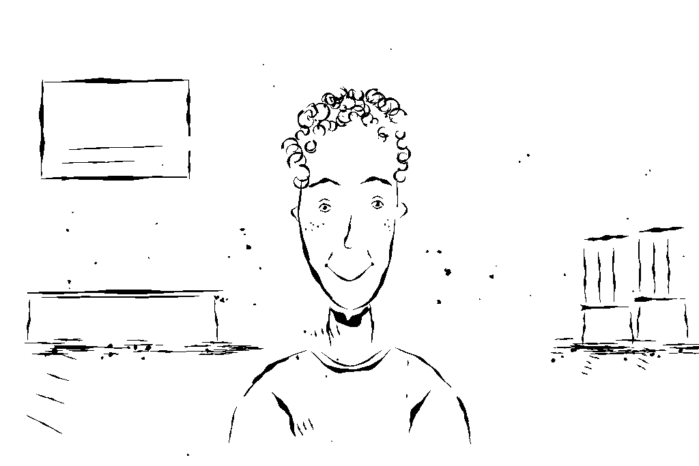
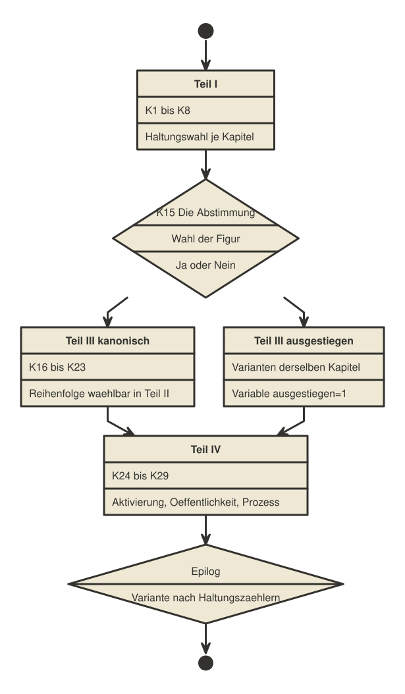

[[handlung]]
= Die Handlung

== Grundsatz: die Novelle bleibt kanonisch

Die Novelle bleibt in ihrem Verlauf verbindlich: das Team stimmt zu, das
Netzwerk entsteht, die Kürzung kommt, das Netzwerk hält. Der Spieler kann
diesen Verlauf nicht kippen, das wäre eine andere Geschichte, keine
Adaption. Was der Spieler stattdessen tut: **er entscheidet, mit welcher
Haltung die Figuren durch die Geschichte gehen.** Genau das ist auch der
eigentliche Stoff der Vorlage, und es passt zu einem Medium, das aus
Dialogboxen besteht.

== Vier Teile und ein Epilog

30 Kapitel, von Januar 2026 bis März 2030, sechs wechselnde
Erzählperspektiven (POV), keine erfundene siebte Spielerfigur:

[cols="1,1,1,2,2"]
|===
|Kapitel |POV |Zeit |Ort / Hintergrund |Rolle in der Geschichte

|1
|Sarah
|Jan 2026
|`sarah-buero`
|Einstieg, erste Haltungswahl

|2
|Jamal
|Mrz 2026
|`innovation-lab`
|Figureneinführung

|3
|Michael
|Apr 2026
|`michael-buero`
|Figureneinführung

|4
|Kat
|Jun 2026
|`kats-wg`, `bri-akademie`
|Figureneinführung

|5
|Lena
|Sep 2026
|`lena-buero`, `cafe-bonn`
|zwei Passagen (Ortswechsel)

|6
|Tom
|Dez 2026
|`innovation-lab`, `ccc-halle`, `konferenzraum`
|drei Passagen

|7
|Sarah
|Mrz 2027
|`konferenzraum`
|Projektablehnung, Wendepunkt

|8
|Michael
|Jun 2027
|`konferenzraum`
|Übergang zu Teil II

|9 bis 14
|je Figur
|Sep 2027
|Wohnungen, Büros, Görlitz
|sechs Vorbereitungsszenen, Reihenfolge wählbar

|15
|Alle
|16.09.2027
|`sarahs-wohnung` + `videokonferenz`
|*Die Abstimmung*, echte Verzweigung

|16
|Sarah
|Okt 2027
|`sarah-buero`
|erste gefälschte Unterschrift

|17
|Jamal
|Jan 2028
|`innovation-lab`
|Architektur

|18
|Kat
|Apr 2028
|`nairobi-hub`
|Hub-Aufbau

|19
|Michael
|Jul 2028
|`michael-buero`
|Zweifel

|20
|Lena
|Okt 2028
|`lena-buero`
|Beinahe-Entdeckung

|21
|Tom
|Jan 2029
|`innovation-lab`
|*Toms Fehler*, Wahl: gestehen oder schweigen

|22
|Sarah
|Apr 2029
|`sarah-buero`
|Konfrontation

|23
|Michael
|Jun 2029
|`michael-buero`
|Entdeckung durch Dr. Hartmann

|24
|Sarah
|Jul 2029
|`sarahs-wohnung`
|Aktivierung, Höhepunkt

|25
|Jamal
|Aug 2029
|`innovation-lab`
|Das Netzwerk lebt

|26
|Kat
|Sep 2029
|`nairobi-hub`
|Hubs senden

|27
|Lena
|Okt 2029
|`pressekonferenz`
|Öffentlichkeit

|28
|Tom
|Nov 2029
|`landgericht`
|Konsequenzen

|29
|Michael
|Dez 2029
|`bad-godesberg`
|Vermächtnis

|30
|Alle
|Mrz 2030
|`bad-godesberg`, BRI
|Epilog, Variante nach Variablen
|===

Teil I (Kapitel 1 bis 8) und Teil IV (Kapitel 24 bis 29) sind streng
linear, je ein Kapitel nach dem anderen. Teil III (Kapitel 16 bis 23) ist
ebenfalls linear, in Abständen von etwa drei Monaten: die Kausalität lässt
keine andere Reihenfolge zu, Toms Fehler in Kapitel 21 (Januar 2029) muss
vor seiner Entdeckung stehen, nicht danach.

== Teil II: die Übersichtskarte

Nur Teil II hat eine frei wählbare Reihenfolge, weil seine sechs Kapitel
tatsächlich am selben Abend spielen: jede der sechs Figuren bereitet sich
für sich auf die Abstimmung vor. Umgesetzt ist das über eine
Übersichtspassage, `t2-runde`, mit bedingten Links:

[source]
----
{if g09 "" else rtext.make["Sarah schreibt die Einladung." "" "k09-einladung"] end}
{gesamt:g09+g10+g11+g12+g13+g14 if 6~gesamt rtext.make["Der 16. September, 20 Uhr." "" "k15-abstimmung"] else "" end}
----

Jedes der sechs Kapitel setzt beim Verlassen ein eigenes Flag (`g09` bis
`g14`) und kehrt zur Übersicht zurück. Die Übersicht zeigt dabei nur noch
die Kapitel, deren Flag noch nicht gesetzt ist, als Auswahlmöglichkeit an.
`rtext.make[text schrift ziel]` erzeugt dafür eine Zeile mit Sprungziel,
die die Engine genau wie einen gewöhnlichen `[[...]]`-Link behandelt.
Erst wenn alle sechs Flags stehen (`gesamt` erreicht 6), erscheint
überhaupt der Weg zur Abstimmung selbst.

== Kapitel 15: die Abstimmung

Kapitel 15 ist die **einzige echte Verzweigung** der gesamten Geschichte.
Der Spieler wählt zunächst, für welche der sechs Figuren er den Zettel
schreibt (Variable `figur`):

[source]
----
? Wessen Zettel ist deiner?

[[Sarah. Die es angefangen hat.->k15-als-sarah]]
[[Jamal. Der am meisten riskiert.->k15-als-jamal]]
[[Michael. Der die Fragen stellt.->k15-als-michael]]
[[Kat. Die die Hubs kennt.->k15-als-kat]]
[[Lena. Die es kommen sah.->k15-als-lena]]
[[Tom. Der am wenigsten zu verlieren hat.->k15-als-tom]]
----

Danach folgt Ja oder Nein. Die Novelle verlangt Einstimmigkeit ("Wenn auch
nur einer Nein sagt, ist das Projekt vorbei."). Ein Nein könnte die
Geschichte an dieser Stelle beenden, und genau das soll es nicht, denn die
Novelle bleibt kanonisch. Gelöst ist das nicht durch Ignorieren der Wahl,
sondern indem die Gruppe ihre eigene Regel unter Druck neu verhandelt: die
Figur des Spielers legt kein Veto gegen das Projekt ein, sondern gegen die
eigene Beteiligung.

[source]
----
:: k15-nein [kapitel-15 teil-2]
{ausgestiegen:1 ""}
...
{"" fuse (figur,": Ich sage nicht, dass ihr es lassen sollt. Ich sage, dass ich es nicht mittrage.")}
...
Am Ende blieben fünf. Einer ging, und nahm alles mit, was er wusste.

[[Michael stand auf.->k15-konsequenzen]]
----

Fünf machen weiter, einer geht. `ausgestiegen` bleibt für den Rest der
Geschichte gesetzt und färbt Schwur, Teil III und den Epilog, etwa im
Schwur am Ende von Kapitel 15:

[source]
----
{if ausgestiegen "Fünf nickten. Der sechste Platz am Tisch war leer, und der Anhänger ging an ihm vorbei." else "Alle nickten." end}
----

Beide Wege (`k15-ja` und `k15-nein`) führen anschließend wieder in
`k15-konsequenzen` und damit zurück in die Hauptlinie zusammen: es ist die
einzige Stelle im ganzen Spiel, an der eine Spielerentscheidung den
Bestand der Gruppe ändert, und sie kostet etwas, ohne die Handlung
strukturell zu brechen.

== Die Variablen im Überblick

[cols="1,1,2,2"]
|===
|Variable |Bereich |Gesetzt durch |Wirkt auf

|`entschlossenheit`
|0 bis 8
|Haltungswahlen Sarah, Lena
|Tonfall in K22, K24, Epilog

|`vorsicht`
|0 bis 8
|Haltungswahlen Jamal, Michael
|Schwere von K21 (Toms Fehler), K23

|`zusammenhalt`
|0 bis 8
|Haltungswahlen Kat, Tom
|Epilog, Schlussbild

|`figur`
|Name
|K15
|wessen Abstimmung der Spieler spricht

|`ausgestiegen`
|0 oder 1
|K15
|Varianten in Teil III und Teil IV

|`tom_gestanden`
|0 oder 1
|K21
|K23, K28 (Prozess)
|===

Diese Variablen bleiben absichtlich wenige: mehr Variablen würden die
Kombinatorik der Textvarianten schnell unübersichtlich machen. Ein
zweiter Wendepunkt liegt in Kapitel 21: Tom entdeckt seinen eigenen
Fehler und entscheidet, ihn zu gestehen oder zu verschweigen
(`tom_gestanden`), was den Ton der Entdeckung in Kapitel 23 und den
Prozess in Kapitel 28 verändert, ohne dass die Handlung selbst
abzweigt.

Textvarianten aus diesen Variablen entstehen direkt im twee, wie in
<<das-datenformat>> gezeigt:

[source]
----
{if entschlossenheit>5 "Sie zögerte keine Sekunde." else "Sie zögerte." end}
----
